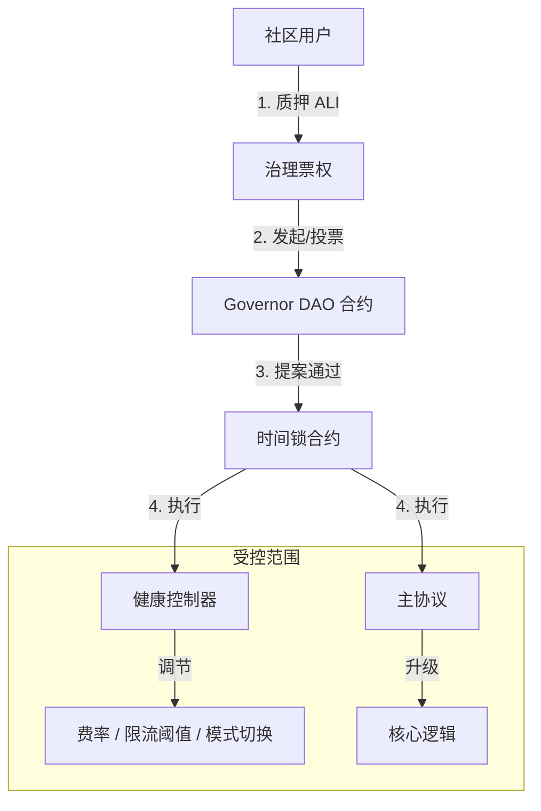

# 代币经济与自治治理模型设计 (Tokenomics & DAO)

本文档旨在阐述 Aliana 协议的代币经济模型与治理架构。我们的目标是将协议的价值完全回馈给社区，实现从“平台管理”向“社区自治 (DAO)”的进化。

---

## 1. 核心愿景

Aliana 不仅仅是一个理财协议，更是一个属于所有参与者的去中心化金融生态。**ALI Token** 是这个生态的血液，它连接了平台价值与用户利益：

1.  **行为激励 共享收益**: 协议赚取的每一分钱，都会通过回购和分红回馈给 ALI 持有者。
2.  **价值捕获 贡献即所得**: 越早参与、贡献越大的用户，将获得越多的 ALI 奖励。
3.  **自治闭环 权利回归**: 告别管理员独裁，参数调整、资金使用全由社区投票决定。

---

## 2. 代币概览 (ALI)

ALI 代币总量恒定，无通胀风险，设计上追求长期价值的稳步增长。

*   **代币名称**: Aliana Governance Token (ALI)
*   **总量硬顶**: **10 亿枚 (1,000,000,000 ALI)**
*   **发行机制**: **永不增发**。所有代币在创世时预生成，后续通过智能合约进行分发。
*   **通缩模型**: 协议收入将持续回购 ALI 并进行销毁或分红，实现流通量的净通缩。

### 2.1 分配方案

我们将 **60%** 的代币完全交予社区，通过公平挖矿产出，确保代币分散在真实用户手中。

| 分配板块 | 数量 (枚) | 占比 | 用途说明 |
| :--- | :--- | :--- | :--- |
| **社区挖矿 (Mining)** | **6 亿** | **60%** | **核心产出**。通过 PoC 机制，根据用户存款、复投等行为公平分发。 |
| **DAO 财库 (Treasury)** | 2 亿 | 20% | 用于协议长期治理、安全储备金及社区重大决议资金支持。 |
| **生态激励 (Ecosystem)** | 2 亿 | 20% | 用于早期贡献者奖励、流动性建设、市场推广及合作伙伴激励。 |

### 2.2 产出机制：贡献即挖矿 (Proof of Contribution)

我们采用独特的 **PoC (Proof of Contribution，贡献证明)** 机制。您无需购买昂贵的矿机，只需像往常一样使用 Aliana 协议，即可自动获得 ALI 奖励。

#### A. 合约参数
- **EPOCH_DURATION**: 30 （30天减产期）
- **DECAY_BPS**: 300（每 30 天产出衰减 3%）
- **BASE_RATE**: 1e16（初始基率：每 1 USDT 产出 0.01 ALI）
- **权重 (WEIGHT_DIVISOR=100)**：
  - `DEPOSIT_WEIGHT` = 100（存款事件权重 1.0x）
  - `COMPOUND_WEIGHT` = 125（复投事件权重 1.25x）
- **挖矿上限**：`miningCap = 600,000,000e18`，累计分发量 `totalMined` 不得超过此上限
- **分发方式**：`MiningController` 从自身余额向用户转账 ALI，不调用增发

#### B. 精简计算公式
```
finalReward = (amount * currentRate / 1e18) * weight / WEIGHT_DIVISOR
// 受 miningCap 与 MiningController 当前余额双重约束
```

#### C. 时间衰减与发行窗口
- 每 30 天自动衰减当前汇率 3%，形成“6 年主窗口 / 10 年完整窗口”的长期释放结构
- 参考年产量分布：
  - 年 0–2：≈35%（≈2.1 亿）
  - 年 2–4：≈25%（≈1.5 亿）
  - 年 4–6：≈20%（≈1.2 亿）
  - 年 6–10：≈15%（≈0.9 亿）
  - 年 10+：≈5%（≈0.3 亿）

---

## 3. 代币效用与价值捕获 (Utility)

ALI 不仅仅是一个治理代币，它是打开 Aliana 高级权益的“金钥匙”。

### 3.1 协议费分红 (Staking for Yield)
目前协议收取 5% (`ADMIN_FEE_PERCENT`) 的管理费。在代币模型引入后，建议调整分配结构：
*   **3%**：继续流向 `TREASURY_WALLET`（团队运营成本）。
*   **1%**：流向 `ReserveVault`（作为《健康监控系统》的备付金）。
*   **1%**：**回购并分配给 ALI 质押者**。
    *   *机制*：智能合约定期将这 1% 的 USDT 在 DEX 换成 ALI，然后分发给 `AliStaking` 池的质押者。

### 3.2 收益加速 (ROI Boost)
持有并质押 ALI 可以提升 USDT 的基础日化收益率（Tier Boost）。
*   *现状*：`TIER_DAILY_ROI_PERCENTS` 依赖入金金额（如 5000 USDT 才能达到最高档）。
*   *新规*：质押 10,000 ALI 可**视同**存入了 1,000 USDT 的等级权重。
*   *价值*：让小资金用户通过持有 Token 也能享受大户的收益率。

### 3.3 治理投票 (Governance)

只有通过质押 ALI 获得的 **vALI (Voting ALI)** 才拥有投票权。采用 **veToken (Vote-Escrowed)** 模型，质押时间越长，投票权重越高。

*   **质押规则**：
    *   **最短质押期**：1 周 (7 天)。
    *   **最长质押期**：4 年 (1460 天)。
*   **权重计算公式**：
    $$ vALI = ALI \times \frac{LockDuration}{MaxDuration} $$
    *   质押 1 ALI 锁定 4 年 = **1.0 vALI**
    *   质押 1 ALI 锁定 1 年 = **0.25 vALI**
    *   质押 1 ALI 锁定 1 周 ≈ **0.0048 vALI**
*   **目的**：确保只有长期利益绑定者（“钻石手”）才能决定协议的未来，防止短期投机者恶意攻击治理。

### 3.4 质押权益汇总
质押 ALI 获得 vALI 后，用户将自动享有以下双重收益：

1.  **协议真金分红 (Real Yield)**：
    *   协议收入的 **1%** 会定期回购 ALI 并分发给 vALI 持有者。
    *   **分发权重**：基于 `vALI` 余额而非 `ALI` 余额（锁定时间越长，分红越多）。
2.  **等级加速 (Tier Boost)**：
    *   主协议中计算日化收益时，`vALI` 余额会计入“虚拟入金额度”。
    *   公式：`EffectiveDeposit = ActualDeposit + (vALI_Balance / 10)`。

---

## 4. 自治治理架构 (Autonomous Governance)

为了实现“可自治的模型”，我们需要用代码替代“管理员私钥”。

### 4.1 治理架构图



### 4.2 治理权限范围
DAO 可以通过提案修改以下内容：

1.  **健康系统参数**：
    *   调整 `minWithdrawAmount`（最小提现额）。
    *   调整 `maxDailyWithdrawPerUser`（限流阈值）。
2.  **模式切换**：
    *   投票决定是否进入 `Stabilize`（去杠杆）或 `Emergency`（紧急）模式。
    *   *注*：紧急模式通常允许“多签委员会”快速开启，但“解除”必须经过 DAO 投票。
3.  **财库分配**：
    *   决定 `ReserveVault` 中的资金何时释放、释放多少用于偿付用户。

### 4.3 治理流程 (Lifecycle)
1.  **提案 (Propose)**：持有 > 1% 总量的 vALI 用户发起提案（例如：“将储备金费率从 2% 调至 3%”）。
2.  **投票 (Vote)**：3 天投票期，需满足法定人数（Quorum，如 4% 总量）。
3.  **公示 (Queue)**：通过后进入 24 小时时间锁（Timelock），给用户反应时间。
4.  **执行 (Execute)**：时间锁结束后，任何人可触发执行，链上参数自动变更。

我们相信代码优于人为干预。Aliana 的最终形态是实现“代码自治”。
通过这一机制，Aliana 将成为一个真正属于社区、自我进化、永续运行的去中心化金融体。

---

*Aliana —— 让每一份信任都有回报，让每一次贡献都被记录。*自治。
