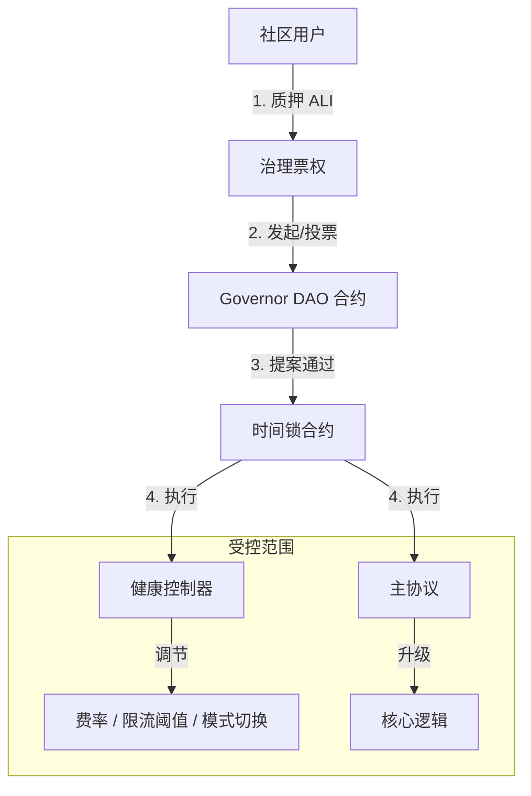

# 代币经济与自治治理模型设计 (Tokenomics & DAO)

本文档旨在为 Aliana 协议设计一套基于 **ALI Token** 的激励与治理闭环系统。该系统将协议的 USDT 现金流价值与 ALI 的治理权深度绑定，实现从“单中心化管理”向“社区自治（DAO）”的平滑过渡。

---

## 1. 设计目标

1.  **行为激励 (Incentive)**：通过 Token 奖励高价值用户行为（大额入金、长期复投、社区推广），降低单纯依赖 USDT 高收益的资金压力。
2.  **价值捕获 (Value Capture)**：Token 必须具有真实的使用场景和价值支撑（如手续费分红、收益加速）。
3.  **自治闭环 (Autonomous Loop)**：将《健康监控自动调节系统》中的 `HealthController` 权限逐步移交给 Token 持有者，实现真正的去中心化调节。

---

## 2. 代币模型 (Tokenomics)

### 2.1 基础信息
*   **名称**: Aliana Governance Token
*   **符号**: **ALI**
*   **标准**: ERC-20；治理票权由 **vALI (ERC20Votes)** 提供
*   **总量上限**: 1,000,000,000 (10 亿枚，硬顶)
*   **增发/通缩**: 合约层面禁止超过 10 亿增发；PoC 挖矿通过预注入池转账分发；后续通过协议收入回购销毁实现净通缩。

### 2.2 分配方案 
| 分配对象 | 数量 | 比例 | 说明 | 解锁规则 |
|---|---|---|---|---|
| **社区挖矿 (Mining)** | 600,000,000 | 60% | 通过 PoC 挖矿按贡献度释放 | 随业务行为线性产出，受 `miningCap` 限制，无额外增发 |
| **DAO 财库 (Treasury)** | 200,000,000 | 20% | 协议治理、资金安全垫与长期生态支持 | 初始铸造至多签或 Timelock，按 DAO 决议拨付 |
| **生态与激励 (Ecosystem)** | 200,000,000 | 20% | 团队激励、流动性、早期贡献者、市场合作 | 通过多个子池归集与线性解锁策略实施 |

### 2.3 产出机制：贡献即挖矿 (Proof of Contribution)

PoC 挖矿依据对主协议的真实贡献进行加权产出，并通过时间衰减控制长期产出速度。所有奖励均从**预注入的 6 亿 ALI 挖矿池**中转账分发，不进行额外增发。

#### A. 合约参数（与实现对齐）
- **EPOCH_DURATION**: 30 days
- **DECAY_BPS**: 300（每 30 天衰减 3%）
- **BASE_RATE**: 1e16（初始汇率：每 1 USDT 产出 0.01 ALI）
- **权重 (WEIGHT_DIVISOR=100)**：
  - `DEPOSIT_WEIGHT` = 100（存款事件权重 1.0x）
  - `COMPOUND_WEIGHT` = 125（复投事件权重 1.25x）
- **挖矿上限**：`miningCap = 600,000,000e18`，累计分发量 `totalMined` 不得超过此上限
- **分发方式**：`MiningController` 从自身余额向用户转账 ALI，不调用增发

#### B. 计算公式（简化）
```
finalReward = (amount * currentRate / 1e18) * weight / WEIGHT_DIVISOR
// 受 miningCap 与 MiningController 当前余额双重约束
```

#### C. 时间衰减与发行窗口
- 每 30 天自动衰减当前汇率 3%，形成“6 年主窗口 / 10 年完整窗口”的长期释放结构
- 参考年产量分布：
  - 年 0–2：≈35%（≈2.1 亿）
  - 年 2–4：≈25%（≈1.5 亿）
  - 年 4–6：≈20%（≈1.2 亿）
  - 年 6–10：≈15%（≈0.9 亿）
  - 年 10+：≈5%（≈0.3 亿）

#### D. 邀请挖矿
- 目前不通过“额外铸造”方式发放邀请挖矿奖励；推荐与团队奖励在主协议的层级与领导力规则中计算，不直接影响 ALI 产出总量。

---

## 3. 代币效用与价值捕获 (Utility)

### 3.1 协议费分红 (Staking for Yield)
目前协议收取 5% (`ADMIN_FEE_PERCENT`) 的管理费。在代币模型引入后，建议调整分配结构：
*   **3%**：继续流向 `TREASURY_WALLET`（团队运营成本）。
*   **1%**：流向 `ReserveVault`（作为《健康监控系统》的备付金）。
*   **1%**：**回购并分配给 ALI 质押者**。
    *   *机制*：智能合约定期将这 1% 的 USDT 在 DEX 换成 ALI，然后分发给 `AliStaking` 池的质押者。

### 3.2 收益加速 (ROI Boost)
持有并质押 ALI 可以提升 USDT 的基础日化收益率（Tier Boost）。
*   *现状*：`TIER_DAILY_ROI_PERCENTS` 依赖入金金额（如 5000 USDT 才能达到最高档）。
*   *新规*：质押 10,000 ALI 可**视同**存入了 1,000 USDT 的等级权重。
*   *价值*：让小资金用户通过持有 Token 也能享受大户的收益率，增加 Token 买盘。

### 3.3 治理投票 (Governance)

只有通过质押 ALI 获得的 **vALI (Voting ALI)** 才拥有投票权。采用 **veToken (Vote-Escrowed)** 模型，质押时间越长，投票权重越高。

*   **质押规则**：
    *   **最短质押期**：1 周 (7 天)。
    *   **最长质押期**：4 年 (1460 天)。
*   **权重计算公式**：
    $$ vALI = ALI \times \frac{LockDuration}{MaxDuration} $$
    *   质押 1 ALI 锁定 4 年 = **1.0 vALI**
    *   质押 1 ALI 锁定 1 年 = **0.25 vALI**
    *   质押 1 ALI 锁定 1 周 ≈ **0.0048 vALI**
*   **目的**：确保只有长期利益绑定者（“钻石手”）才能决定协议的未来，防止短期投机者恶意攻击治理。

### 3.4 质押权益汇总
质押 ALI 获得 vALI 后，用户将自动享有以下双重收益：

1.  **协议真金分红 (Real Yield)**：
    *   协议收入的 **1%** 会定期回购 ALI 并分发给 vALI 持有者。
    *   **分发权重**：基于 `vALI` 余额而非 `ALI` 余额（锁定时间越长，分红越多）。
2.  **等级加速 (Tier Boost)**：
    *   主协议中计算日化收益时，`vALI` 余额会计入“虚拟入金额度”。
    *   公式：`EffectiveDeposit = ActualDeposit + (vALI_Balance / 10)`。

---

## 4. 自治治理架构 (Autonomous Governance)

为了实现“可自治的模型”，我们需要用代码替代“管理员私钥”。

### 4.1 治理架构图



### 4.2 治理权限范围
DAO 可以通过提案修改以下内容：

1.  **健康系统参数**：
    *   调整 `minWithdrawAmount`（最小提现额）。
    *   调整 `maxDailyWithdrawPerUser`（限流阈值）。
2.  **模式切换**：
    *   投票决定是否进入 `Stabilize`（去杠杆）或 `Emergency`（紧急）模式。
    *   *注*：紧急模式通常允许“多签委员会”快速开启，但“解除”必须经过 DAO 投票。
3.  **财库分配**：
    *   决定 `ReserveVault` 中的资金何时释放、释放多少用于偿付用户。

### 4.3 治理流程 (Lifecycle)
1.  **提案 (Propose)**：持有 > 1% 总量的 vALI 用户发起提案（例如：“将储备金费率从 2% 调至 3%”）。
2.  **投票 (Vote)**：3 天投票期，需满足法定人数（Quorum，如 4% 总量）。
3.  **公示 (Queue)**：通过后进入 24 小时时间锁（Timelock），给用户反应时间。
4.  **执行 (Execute)**：时间锁结束后，任何人可触发执行，链上参数自动变更。

---

## 5. 链上实施建议

### 5.1 新增合约模块
1.  **`AlianaToken.sol`**：
    *   基于 `ERC20Votes`，支持快照投票。
    *   包含 `mint` 权限控制（仅限 `MiningController`）。
2.  **`MiningController.sol`**：
    *   管理挖矿速率、减产周期。
    *   计算用户应得 Token。
3.  **`AliStaking.sol`**：
    *   用户质押 ALI，领取 USDT 分红（来自回购）。
    *   提供 `getBoostMultiplier(user)` 接口给主协议查询等级加成。

### 5.2 主协议改造 (`AlianaProtocol.sol`)
需要增加钩子函数以支持“挖矿”和“等级加成”：

```solidity
// 1. 挖矿钩子
function makeDeposit(...) {
    // ... 原有逻辑 ...
    if (miningController != address(0)) {
        miningController.notifyDeposit(msg.sender, amount); // 触发挖矿
    }
}

function compoundDailyRewards(...) {
    // ... 原有逻辑 ...
    if (miningController != address(0)) {
        miningController.notifyCompound(msg.sender, amount); // 触发高权重挖矿
    }
}

// 2. 等级加成读取
function _getTierIndex(uint256 amount) internal view returns (uint256) {
    uint256 effectiveAmount = amount;
    // 叠加 Token 质押带来的虚拟额度
    if (aliStaking != address(0)) {
        effectiveAmount += aliStaking.getBoostAmount(msg.sender);
    }
    // ... 原有等级判断逻辑 ...
}
```

---

## 6. 总结

该模型通过引入 **ALI Token**，解决了三个核心问题：
1.  **资金健康**：通过复投挖矿加权，引导用户减少提现。
2.  **用户留存**：通过 Token 质押加成（ROI Boost），让用户长期锁定 Token 和 USDT。
3.  **去中心化信任**：通过 DAO 接管 `HealthController`，消除用户对“管理员权限”的顾虑，实现真正的代码自治。
